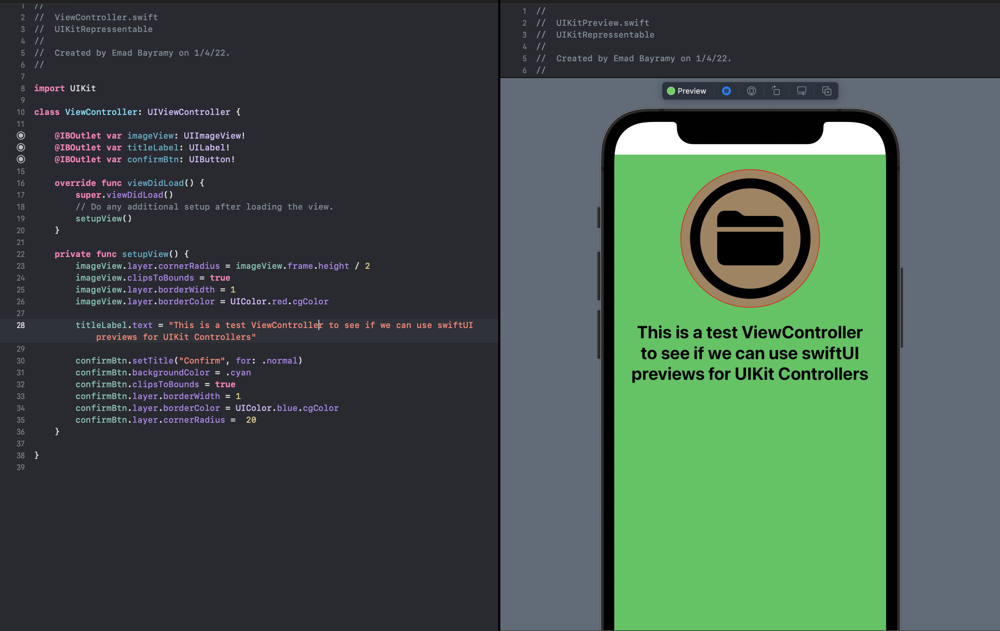

# SwiftUI preview provider for UIKit
### A simple way to see your UIKit ViewController changes live and on-demand.

This is a practical project for my article 
[SwiftUI preview provider for UIKit](https://medium.com/@emad.beyrami/swiftui-preview-provider-for-uikit-3dd089d77915)
it is usefull. read it. :)

# Introduction
Have you ever tried the SwiftUI?
haven’t you found it so delightful and easy to work with?
In UIKit views, if you are working on a piece of design that is mostly working with your codebase and you have to check it every once in a while to make sure your code makes the UI design you are trying to make; So every now and then you compile and build your code into the simulator to check your code result but in SwiftUI you can see the changes you made on-demand without having to wait for your project to build and compile.
What if we can use that or something similar to it for our UIKit Components?
If you are looking for this here is the answer for you!
